# 🎹 CT Scanning and Numerical Modelling of an Early Piano’s Soundboard

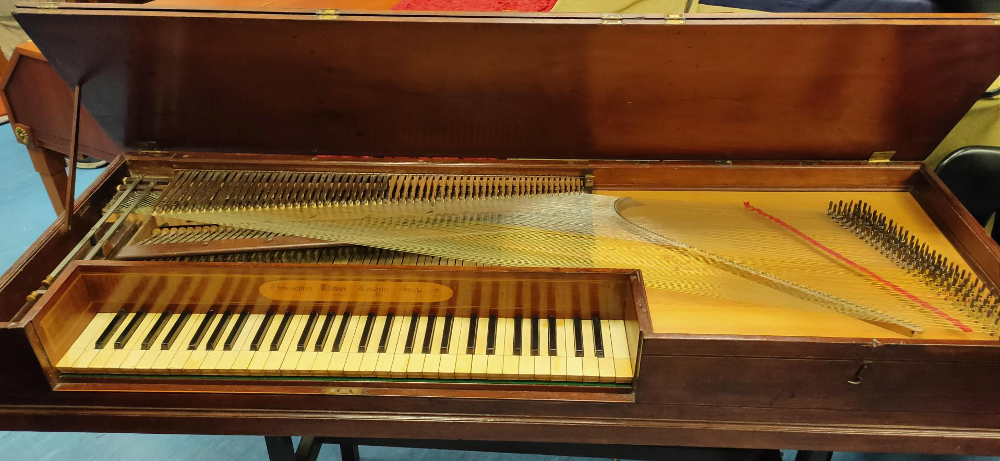

**Author:** Pranav Duraivel  

---

## 📜 Abstract

This project presents a comprehensive study of the vibroacoustic properties of an 18th-century Ganer Square Piano soundboard using **X-ray CT scanning**, **experimental testing**, and **finite element (FE) numerical modelling**. By reconstructing high-fidelity geometry and simulating structural dynamics, this work aims to bridge historical craftsmanship with modern acoustical science.

---

## 🎯 Objectives

1. Use X-ray CT to extract internal geometry of the Ganer piano soundboard.
2. Process scans into CAD-ready 3D meshes.
3. Develop a validated FE model using COMSOL.
4. Conduct experimental vibroacoustic testing.
5. Compare and tune the simulation using experimental mobility results.
6. Optimize material properties to minimize simulation-experiment error.
7. Contribute to historical instrument preservation.

---

## 🧠 Key Concepts

### 📈 Lambert-Beer Law for CT Intensity

```math 
I = I_0 e^{-\mu d}
```

- (I₀): Initial beam intensity  
- (I): Transmitted intensity  
- (μ): Material attenuation coefficient  
- (d): Material thickness

---

### 🔍 Density Estimation from Hounsfield Units

```math 
\rho_i = A \cdot x_i + B
```

- (ρᵢ): Density of element (i)  
- (xᵢ): Average HU of voxels  
- (A,B): Calibration constants (e.g., ( A ≈ 0.0008754 ), ( B ≈ 1 times 10⁻³))

---

## 🛠 Methodology

### 1. CT Scanning Setup

- Equipment: **diondo d5**
- Resolution: **419 μm** and **209 μm**
- Filters: 1mm Al, 0.5mm Cu
- 102,312 total images, 11-hour scan duration

<p align="center">
  
  <br/><i>CT scan setup for 1781 Ganer Square Piano</i>
</p>

---

### 2. 3D Reconstruction and CAD

- Software used: FIJI (ImageJ), Dragonfly 3D
- Generated high-quality STL and mesh files for FE analysis

<!--<p align="center">
  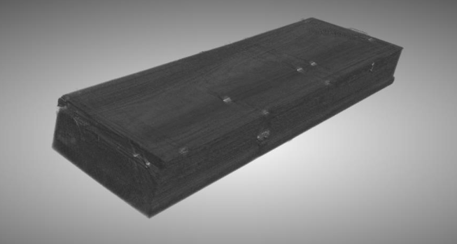
  <br/><i>Smoothed 3D CAD model of the soundboard</i>
</p>

<p align="center">
  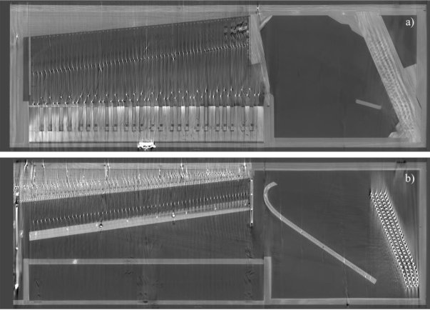
  <br/><i>Sliced view a) Top view b) bottom view</i>
</p>

<p align="center">
  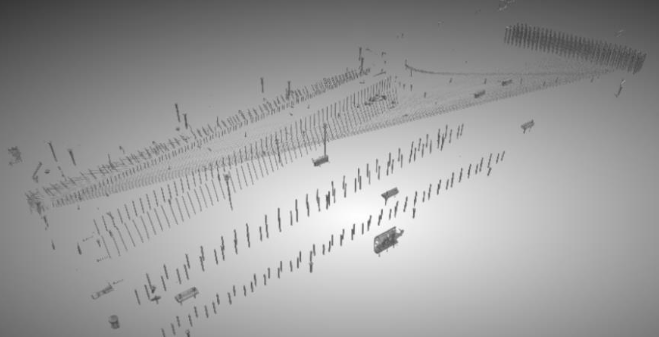
  <br/><i>Seperating metal parts/artifacts</i>
</p>

<p align="center">
  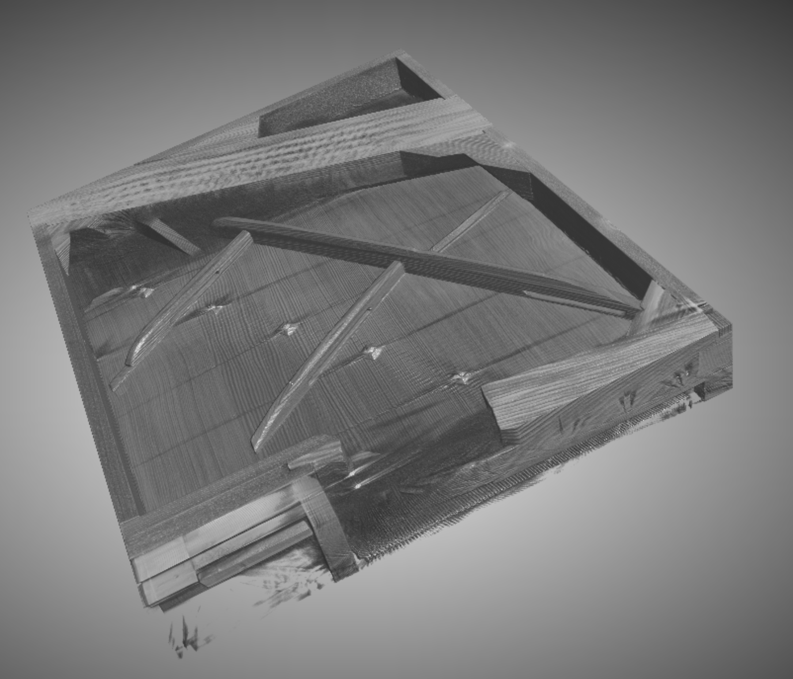
  <br/><i>Piano's soundboard</i>
</p> -->
<table>
  <tr>
    <td align="center">
      <br/>
      <sub>Smoothed 3D CAD model of the soundboard</sub>
    </td>
    <td align="center">
      <br/>
      <sub>Sliced view a) Top view b) bottom view</sub>
    </td>
  </tr>
  <tr>
    <td align="center">
      <br/>
      <sub>Seperating metal parts/artifacts</sub>
    </td>
    <td align="center">
      <br/>
      <sub>Piano's soundboard</sub>
    </td>
  </tr>
</table>


### 3. Experimental Vibroacoustic Testing

- Location: Anechoic Chamber, ISVR
- Tests: Point Mobility, Coherence, Sound Radiation
- Equipment: Impact Hammer, PCB Accelerometers, LMS SignalCalc

<p align="center">
  
  <br/><i>Experimental setup for mobility testing</i>
</p>

---

### 4. Finite Element Modelling

- Software: COMSOL Multiphysics
- Solid Mechanics, Modal & Frequency Response
- Meshing sensitivity study: λ/8 vs λ/30
- Boundary conditions: Simply supported

<p align="center">
  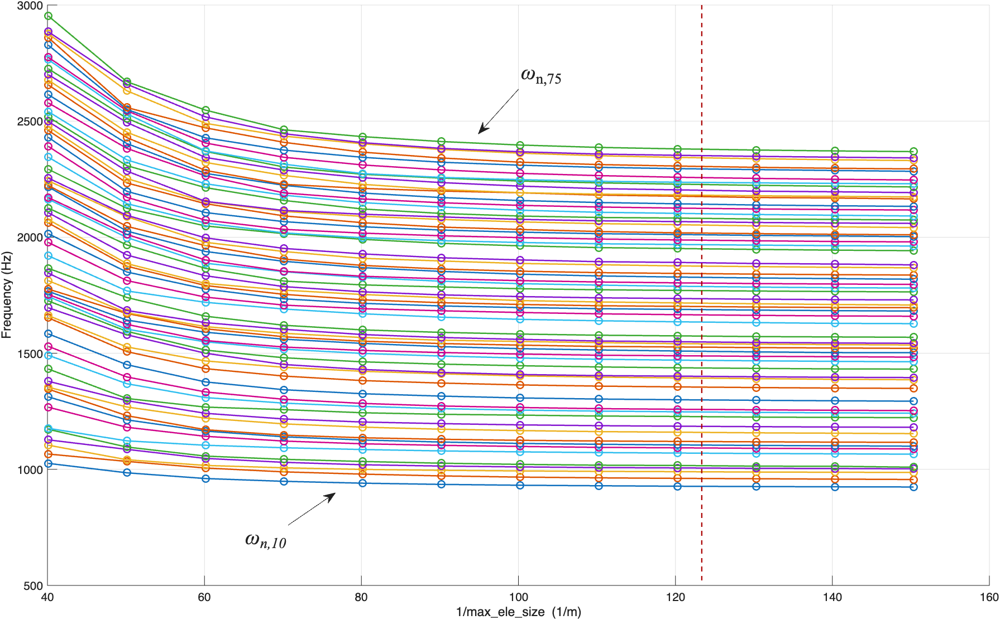
  <br/><i>Mesh convergence study for eigenfrequencies</i>
</p>

---

### 🎼 Experimental vs Numerical Mobility Comparison

The plot below compares the **measured point mobility** from experimental impact testing with the **numerical mobility** simulated using COMSOL Multiphysics at two key locations:

- **Top Plot**: Driving point mobility at **C4** (Middle C)
- **Bottom Plot**: Driving point mobility at **C6** (High C)

<p align="center">
  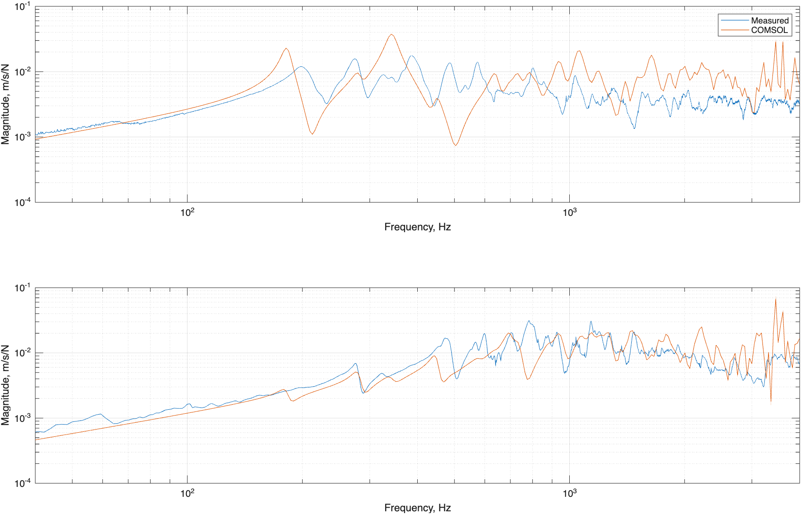
  <br/><i>Figure 2: Measured vs Simulated Point Mobility at C4 and C6</i>
</p>

#### 📌 Observations:

- The resonant peaks in both measurements align closely between 100 Hz and 2 kHz.
- The numerical simulation slightly overestimates modal amplitudes at certain frequencies.
- Higher frequency discrepancies may result from simplifications in boundary conditions and damping.

This comparison validates the FE model and demonstrates the feasibility of recreating historical piano vibroacoustics numerically.

### 5. Optimisation and Validation

- Compared **experimental** vs **numerical mobility**
- Tuned (E), (ρ), and thickness using optimisation loops
  
```math
\xi(\omega) = Y(\omega) F(\omega)
```

- (ξ(ω)): Velocity response  
- (Y(ω))): Mechanical admittance  
- (F(ω))): String force input

---

## 📊 Results

- ✅ Successfully reconstructed detailed CAD geometry of 18th-century soundboard  
- 📈 Achieved <10% error in modal frequencies with optimised model  
- 🎧 Clear difference in point mobility between early and modern pianos  
- 🔁 Developed workflow applicable to other historical wooden instruments

---

## 📸 Gallery

<p align="center">
  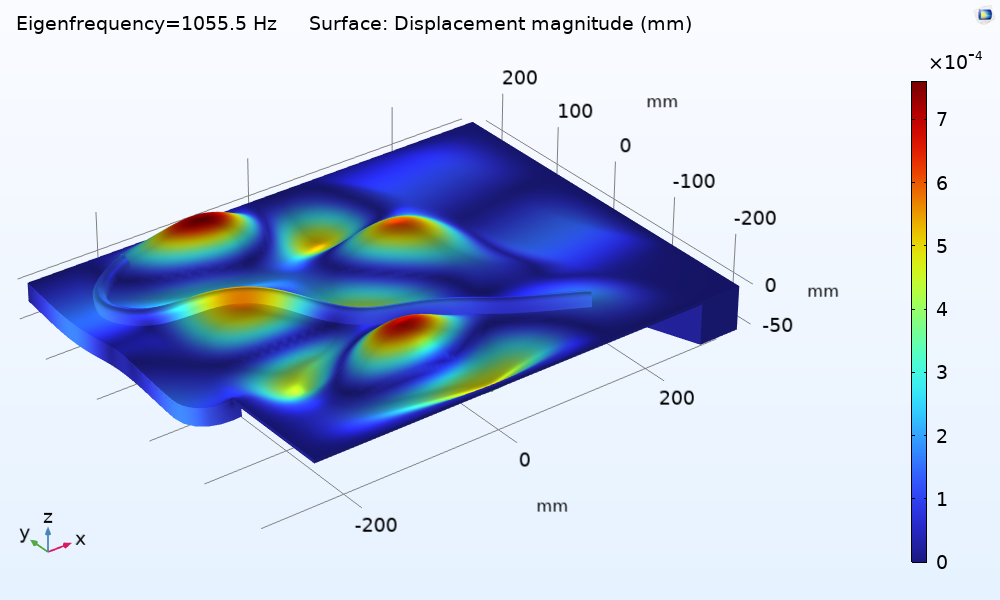
  <br/><i>Mode shapes from COMSOL simulation</i>
</p>

<table>
  <tr>
    <td align="center">
      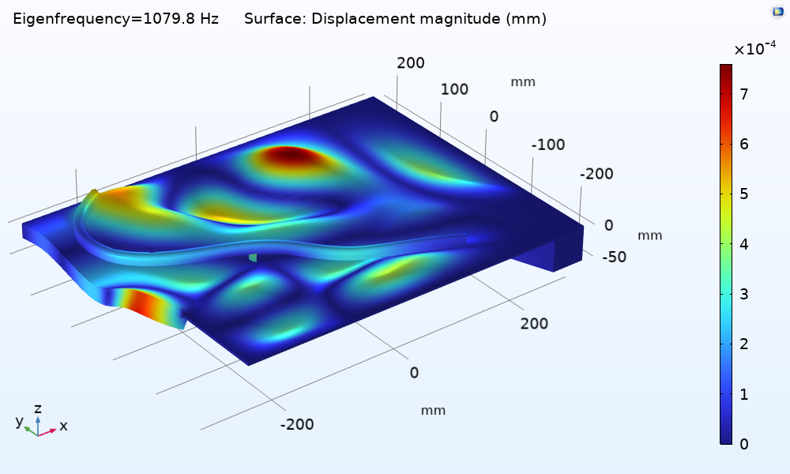<br/>
    </td>
    <td align="center">
      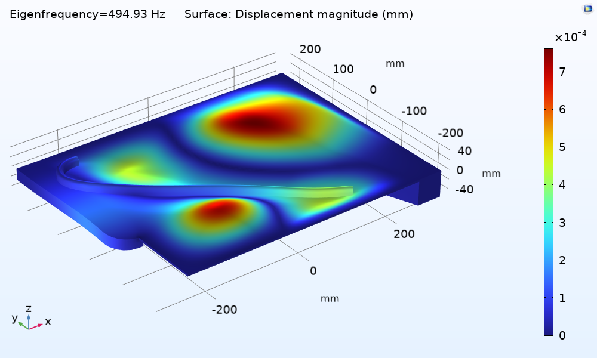<br/>
    </td>
  </tr>
  <tr>
    <td align="center">
      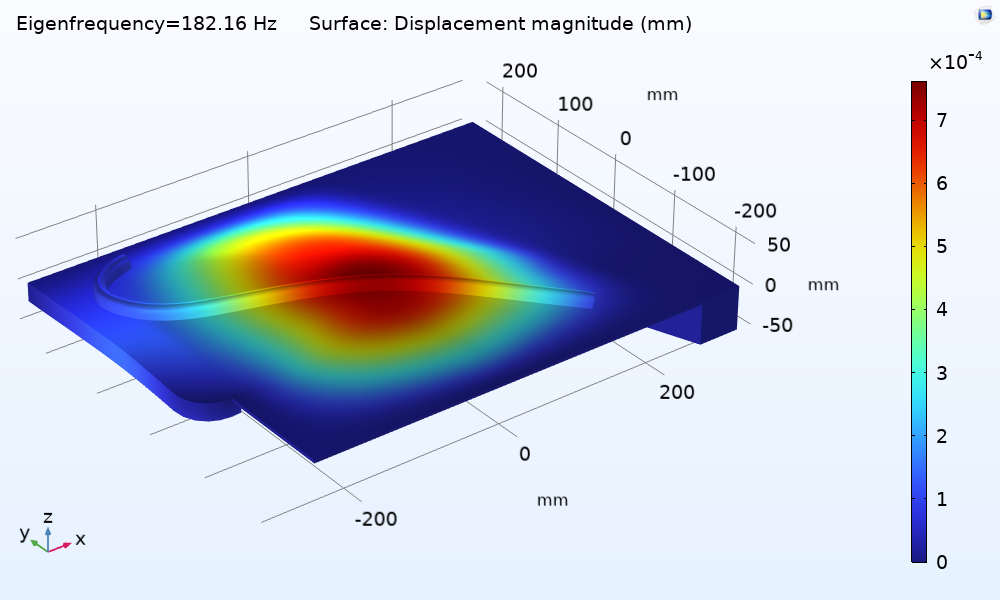<br/>
    </td>
    <td align="center">
      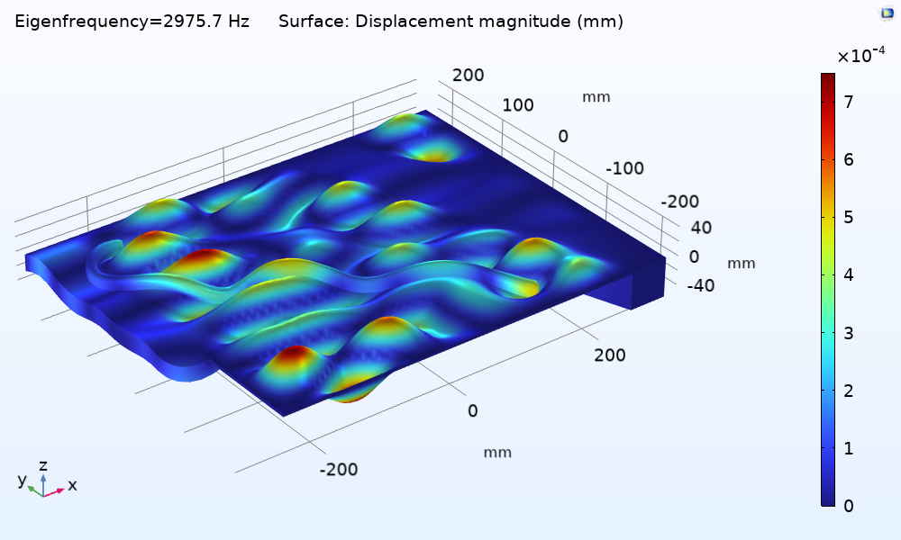<br/>
    </td>
  </tr>
</table>

## 💡 Future Work

- Integration of **nonlinear contact models** in action mechanism
- Development of full **digital twin** of historical pianos
- Application of BEM for better sound radiation predictions

---
